# Homework 10


## Goals:
**One of the following:**  
1. Combine two existing datasets in a novel (and reproducible!) way; at least one must come from the web  
2. Create a new dataset by web scraping

**I can accomplish these goals with the following methods:**  
1. Accessing data using rOpenSci packages that wrap APIs  
2. Running (basic) API queries “by hand”  
3. Web scraping  

Let's start with the packages we'll be using.

```r
suppressPackageStartupMessages(library(dplyr))
library(ggplot2)
library(rebird)
library(rplos)
library(geonames)
library(knitr)
library(countrycode)
library(gapminder)
library(tidyr)
library(scales)
library(httr)
library(rvest)
```

```
## Loading required package: xml2
```

Now, let's think about Jenny's suggestion of combining the data from some combination of these packages:  
* `rplos`  
* `rebird`  
* `geonames`  

I've also looked through the `rOpenSci` packages list and found some interesting candidates:
* `cartographer`  
* `rbison`  
* `spocc`, which combines  
	+ `rgbif`  
	+ `ecoengine`   
	+ `rinat`  
	+ `rebird`   
	+ `AntWeb`  
	
## Let's start with the first three packages.  
Note: Here I'm using my API key to access the PLoS API.  To replicate this functionality, simply sign up for a key and add it into your `.Rprofile` or `.Renviron` file. I've included the code here for either method to work, just switch the chunk option `eval = FALSE` to whichever file you're not using. 

For an API key stored in `.Renviron`

```r
Sys.setenv(PlosApiKey = "YOUR_KEY")
key <- Sys.getenv("PlosApiKey")
```

For an API key stored in `.Rprofile`, add the line `options(PlosApiKey = "YOUR_KEY")` to your `.Rprofile` file. Then, use this code:

```r
key <- getOption("PlosApiKey")
```

Now let's do some searches! Note that we can check out which fields to search by looking at the `plosfields` data.frame, specifically `plosfields$field`.  Also available [here](http://api.plos.org/solr/search-fields/). 

```r
plosfields$field
```

```
##  [1] "abstract"                      "abstract_ngram"               
##  [3] "abstract_primary_display"      "accepted_date"                
##  [5] "affiliate"                     "affiliate_facet"              
##  [7] "alternate_title"               "article_type"                 
##  [9] "article_type_facet"            "author"                       
## [11] "author_affiliate"              "author_collab_only_display"   
## [13] "author_display"                "author_facet"                 
## [15] "author_notes"                  "author_without_collab_display"
## [17] "body"                          "body_ngram"                   
## [19] "body_rev"                      "competing_interest"           
## [21] "conclusions"                   "copyright"                    
## [23] "counter_total_all"             "counter_total_month"          
## [25] "cross_published_journal_eissn" "cross_published_journal_key"  
## [27] "cross_published_journal_name"  "doc_partial_body"             
## [29] "doc_partial_parent_id"         "doc_partial_type"             
## [31] "doc_type"                      "editor"                       
## [33] "editor_affiliate"              "editor_display"               
## [35] "editor_facet"                  "eissn"                        
## [37] "elocation_id"                  "everything"                   
## [39] "everything_ngram"              "everything_noprocess"         
## [41] "everything_rev"                "figure_table_caption"         
## [43] "financial_disclosure"          "id"                           
## [45] "introduction"                  "issue"                        
## [47] "journal"                       "journal_id_nlm_ta"            
## [49] "journal_id_pmc"                "journal_id_publisher"         
## [51] "materials_and_methods"         "pagecount"                    
## [53] "pissn"                         "publication_date"             
## [55] "publisher"                     "received_date"                
## [57] "reference"                     "results_and_discussion"       
## [59] "subject"                       "subject_facet"                
## [61] "subject_hierarchy"             "subject_level_1"              
## [63] "subject2"                      "subject2_facet"               
## [65] "subject2_hierarchy"            "subject2_level_1"             
## [67] "supporting_information"        "timestamp"                    
## [69] "title"                         "title_display"                
## [71] "title_ngram"                   "volume"
```

```r
USPubs <- searchplos("affiliate:United States of America",
										 fl = "affiliate",
										 key = key)
USPubNum <- USPubs$meta$numFound
str(USPubNum)
```

```
##  int 88128
```

```r
USPubs
```

```
## $meta
##   numFound start maxScore
## 1    88128     0       NA
## 
## $data
##                                                                                                                                                                                                                                                                                                                                                                                                                                                                                                                                       affiliate
## 1  The George Washington University, Washington, D. C, United States of America; Vaccine Institute, Washington, D. C, United States of America; Liverpool School of Tropical Medicine, Liverpool, United Kingdom; Imperial College London, London, United Kingdom; Schistosomiasis Control Initiative, London, United Kingdom; Emory University, Atlanta, Georgia, United States of America; Lymphatic Filariasis Support Center, Atlanta, Georgia, United States of America; Columbia University, New York, New York, United States of America
## 2                                                                                                                                                                                                                                                                                                                                                                                                                                                                                Gatsby Computational Neuroscience Unit, London, United Kingdom
## 3                                                                                                                                                                                                                                                                                                                                                                                                                                                                 United States Department of State, Washington, D.C., United States of America
## 4                                                                                                                                                                                                                                                                                                                                                                                                                                                                                                       Dallas, Texas, United States of America
## 5                                                                                                                                                                                                                                                                                                                                                                                                             United States Naval Medical Research Unit Six (NAMRU-6), Lima, Peru; United States Army, El Paso, Texas, United States of America
## 6                                                                                                                                                                                                                                                                                                                                                                                                                                                                                            Harrisburg, Pennsylvania, United States of America
## 7                                                                                                                                                                                                                                                                                                                                                                                                                                                                             University of Toronto, Toronto, Ontario, United States of America
## 8                                                                                                                                                                                                                                                                                                                                                                                        Florida State University, Tallahassee, Florida, United States of America; Lincoln Memorial University, Harrogate, Tennesseee, United States of America
## 9                                                                                                                                                                                                                                                                                                                                                                                                                                                 Public Library of Science, Cambridge, United Kingdom; PLoS Medicine, United States of America
## 10                                                                                                                                                                                                                                                                                                                                                                                                                                                                                University of Miami, Miami, Florida, United States of America
```

Whoops, you can barely read `USPubs$data`. 

```r
USPubs$data %>% 
	kable("markdown", align = "l")
```


|affiliate                                                                                                                                                                                                                                                                                                                                                                                                                                                                                                                                    |
|:--------------------------------------------------------------------------------------------------------------------------------------------------------------------------------------------------------------------------------------------------------------------------------------------------------------------------------------------------------------------------------------------------------------------------------------------------------------------------------------------------------------------------------------------|
|The George Washington University, Washington, D. C, United States of America; Vaccine Institute, Washington, D. C, United States of America; Liverpool School of Tropical Medicine, Liverpool, United Kingdom; Imperial College London, London, United Kingdom; Schistosomiasis Control Initiative, London, United Kingdom; Emory University, Atlanta, Georgia, United States of America; Lymphatic Filariasis Support Center, Atlanta, Georgia, United States of America; Columbia University, New York, New York, United States of America |
|Gatsby Computational Neuroscience Unit, London, United Kingdom                                                                                                                                                                                                                                                                                                                                                                                                                                                                               |
|United States Department of State, Washington, D.C., United States of America                                                                                                                                                                                                                                                                                                                                                                                                                                                                |
|Dallas, Texas, United States of America                                                                                                                                                                                                                                                                                                                                                                                                                                                                                                      |
|United States Naval Medical Research Unit Six (NAMRU-6), Lima, Peru; United States Army, El Paso, Texas, United States of America                                                                                                                                                                                                                                                                                                                                                                                                            |
|Harrisburg, Pennsylvania, United States of America                                                                                                                                                                                                                                                                                                                                                                                                                                                                                           |
|University of Toronto, Toronto, Ontario, United States of America                                                                                                                                                                                                                                                                                                                                                                                                                                                                            |
|Florida State University, Tallahassee, Florida, United States of America; Lincoln Memorial University, Harrogate, Tennesseee, United States of America                                                                                                                                                                                                                                                                                                                                                                                       |
|Public Library of Science, Cambridge, United Kingdom; PLoS Medicine, United States of America                                                                                                                                                                                                                                                                                                                                                                                                                                                |
|University of Miami, Miami, Florida, United States of America                                                                                                                                                                                                                                                                                                                                                                                                                                                                                |

Well this works pretty well. It should be noted that this returns papers with any author in the US.
This should still be okay for us though, let's put in a function.

```r
pubs <- function(x){
	pubnum <- searchplos(paste(c("affiliate", x), collapse = ":"),
										 key = key)
	return(pubnum$meta$numFound)
}
```

Alright, let's test it again!

```r
(US <- pubs("United States of America"))
```

```
## [1] 88128
```

```r
(Canada <- pubs("Canada"))
```

```
## [1] 13431
```

Let's try applying this over a list from geonames. Make sure you've setup a profile at [geonames.org](geonames.org), check out the [class notes](https://raw.githubusercontent.com/STAT545-UBC/STAT545-UBC.github.io/master/webdata02_activity.Rmd) for specifics. 

```r
countryInfo <- GNcountryInfo()
countryInfo %>% 
	head() %>% 
	kable("markdown")
```


|continent |capital          |languages         |geonameId |south            |isoAlpha3 |north            |fipsCode |population |east             |isoNumeric |areaInSqKm |countryCode |west             |countryName                     |continentName |currencyCode |
|:---------|:----------------|:-----------------|:---------|:----------------|:---------|:----------------|:--------|:----------|:----------------|:----------|:----------|:-----------|:----------------|:-------------------------------|:-------------|:------------|
|EU        |Andorra la Vella |ca                |3041565   |42.4284925987684 |AND       |42.6560438963    |AN       |84000      |1.78654277783198 |020        |468.0      |AD          |1.40718671411128 |Principality of Andorra         |Europe        |EUR          |
|AS        |Abu Dhabi        |ar-AE,fa,en,hi,ur |290557    |22.6333293914795 |ARE       |26.0841598510742 |AE       |4975593    |56.3816604614258 |784        |82880.0    |AE          |51.5833282470703 |United Arab Emirates            |Asia          |AED          |
|AS        |Kabul            |fa-AF,ps,uz-AF,tk |1149361   |29.377472        |AFG       |38.483418        |AF       |29121286   |74.879448        |004        |647500.0   |AF          |60.478443        |Islamic Republic of Afghanistan |Asia          |AFN          |
|NA        |Saint John’s     |en-AG             |3576396   |16.996979        |ATG       |17.729387        |AC       |86754      |-61.672421       |028        |443.0      |AG          |-61.906425       |Antigua and Barbuda             |North America |XCD          |
|NA        |The Valley       |en-AI             |3573511   |18.166815        |AIA       |18.283424        |AV       |13254      |-62.971359       |660        |102.0      |AI          |-63.172901       |Anguilla                        |North America |XCD          |
|EU        |Tirana           |sq,el             |783754    |39.648361        |ALB       |42.665611        |AL       |2986952    |21.068472        |008        |28748.0    |AL          |19.293972        |Republic of Albania             |Europe        |ALL          |

Looks like `countryInfo$countryName` will be the most useful to us at the moment.  Let's make it into levels so we don't query the same country more than once. 

```r
str(countryInfo$countryName)
```

```
##  chr [1:250] "Principality of Andorra" "United Arab Emirates" ...
```

```r
countrynames <- unique(countryInfo$countryName)
str(countrynames)
```

```
##  chr [1:250] "Principality of Andorra" "United Arab Emirates" ...
```

Well, looks like there was only one value for each already, that should've been obvious! Let me just check the PLoS API documentation real quick:  
> Please limit your API requests to 7200 requests a day, 300 per hour, 10 per minute and allow 5 seconds for your search to return results. If you exceed this threshold, we will lock out your IP address. If you’re a high-volume user of the PLOS Search API and need more API requests a day, please contact us at api@plos.org to discuss your options. We currently limit API users to no more than five concurrent connections from a single IP address.

Okay, so if I query all these countries right now, I'm probably going to exceed my hourly limit immediately.  Let's stick to a top few, perhaps ordered by GDP, because I have a feeling that I'm going to draw a lot of blanks from lower GDP countries that aren't conducting research (published to PLoS). If I **did** just want to query all of the countries listed, this would be the code to do so:

```r
countrypubs <- lapply(countrynames, FUN = pubs)
```

Let's see what we can sort by. 

```r
str(countryInfo)
```

```
## 'data.frame':	250 obs. of  17 variables:
##  $ continent    : chr  "EU" "AS" "AS" "NA" ...
##  $ capital      : chr  "Andorra la Vella" "Abu Dhabi" "Kabul" "Saint John’s" ...
##  $ languages    : chr  "ca" "ar-AE,fa,en,hi,ur" "fa-AF,ps,uz-AF,tk" "en-AG" ...
##  $ geonameId    : chr  "3041565" "290557" "1149361" "3576396" ...
##  $ south        : chr  "42.4284925987684" "22.6333293914795" "29.377472" "16.996979" ...
##  $ isoAlpha3    : chr  "AND" "ARE" "AFG" "ATG" ...
##  $ north        : chr  "42.6560438963" "26.0841598510742" "38.483418" "17.729387" ...
##  $ fipsCode     : chr  "AN" "AE" "AF" "AC" ...
##  $ population   : chr  "84000" "4975593" "29121286" "86754" ...
##  $ east         : chr  "1.78654277783198" "56.3816604614258" "74.879448" "-61.672421" ...
##  $ isoNumeric   : chr  "020" "784" "004" "028" ...
##  $ areaInSqKm   : chr  "468.0" "82880.0" "647500.0" "443.0" ...
##  $ countryCode  : chr  "AD" "AE" "AF" "AG" ...
##  $ west         : chr  "1.40718671411128" "51.5833282470703" "60.478443" "-61.906425" ...
##  $ countryName  : chr  "Principality of Andorra" "United Arab Emirates" "Islamic Republic of Afghanistan" "Antigua and Barbuda" ...
##  $ continentName: chr  "Europe" "Asia" "Asia" "North America" ...
##  $ currencyCode : chr  "EUR" "AED" "AFN" "XCD" ...
```

Looks like there's actually not much here. Maybe we can bring in `gapminder` to add in some GDP data. 

```r
str(gapminder)
```

```
## 'data.frame':	1704 obs. of  6 variables:
##  $ country  : Factor w/ 142 levels "Afghanistan",..: 1 1 1 1 1 1 1 1 1 1 ...
##  $ continent: Factor w/ 5 levels "Africa","Americas",..: 3 3 3 3 3 3 3 3 3 3 ...
##  $ year     : num  1952 1957 1962 1967 1972 ...
##  $ lifeExp  : num  28.8 30.3 32 34 36.1 ...
##  $ pop      : num  8425333 9240934 10267083 11537966 13079460 ...
##  $ gdpPercap: num  779 821 853 836 740 ...
```

```r
unique(gapminder$year)
```

```
##  [1] 1952 1957 1962 1967 1972 1977 1982 1987 1992 1997 2002 2007
```

```r
gapmindersingle <- gapminder %>% 
	filter(year == 2007)
str(gapmindersingle)
```

```
## 'data.frame':	142 obs. of  6 variables:
##  $ country  : Factor w/ 142 levels "Afghanistan",..: 1 2 3 4 5 6 7 8 9 10 ...
##  $ continent: Factor w/ 5 levels "Africa","Americas",..: 3 4 1 1 2 5 4 3 3 4 ...
##  $ year     : num  2007 2007 2007 2007 2007 ...
##  $ lifeExp  : num  43.8 76.4 72.3 42.7 75.3 ...
##  $ pop      : num  31889923 3600523 33333216 12420476 40301927 ...
##  $ gdpPercap: num  975 5937 6223 4797 12779 ...
```

Okay, now we've got just the most recent year's data for each country.  Looks like we've also just got 142 countries now, versus 250 in the `geonames` dataset.  We can combine these with `inner_join`, but we should make sure to use a standardized country code, such as `ISO3-numeric` or `ISO3-character`, which is listed in `countryInfo$isoNumeric`& `countryInfo$isoAlpha3`. 

```r
gapmindersingle$isoAlpha3 <- countrycode(gapmindersingle$country, "country.name", "iso3c")
str(gapmindersingle)
```

```
## 'data.frame':	142 obs. of  7 variables:
##  $ country  : Factor w/ 142 levels "Afghanistan",..: 1 2 3 4 5 6 7 8 9 10 ...
##  $ continent: Factor w/ 5 levels "Africa","Americas",..: 3 4 1 1 2 5 4 3 3 4 ...
##  $ year     : num  2007 2007 2007 2007 2007 ...
##  $ lifeExp  : num  43.8 76.4 72.3 42.7 75.3 ...
##  $ pop      : num  31889923 3600523 33333216 12420476 40301927 ...
##  $ gdpPercap: num  975 5937 6223 4797 12779 ...
##  $ isoAlpha3: chr  "AFG" "ALB" "DZA" "AGO" ...
```

Alright, let's take a look!

```r
gapmindersingle %>% 
	select(country, isoAlpha3) %>% 
	head() %>% 
	kable("markdown")
```


|country     |isoAlpha3 |
|:-----------|:---------|
|Afghanistan |AFG       |
|Albania     |ALB       |
|Algeria     |DZA       |
|Angola      |AGO       |
|Argentina   |ARG       |
|Australia   |AUS       |

```r
gapmindersingle %>% 
	select(country, isoAlpha3) %>% 
	tail() %>% 
	kable("markdown")
```


|    |country            |isoAlpha3 |
|:---|:------------------|:---------|
|137 |Venezuela          |VEN       |
|138 |Vietnam            |VNM       |
|139 |West Bank and Gaza |PSE       |
|140 |Yemen, Rep.        |YEM       |
|141 |Zambia             |ZMB       |
|142 |Zimbabwe           |ZWE       |

Not too bad.  Now let's combine! 

```r
GapAndGeo <- inner_join(countryInfo, gapmindersingle, by = "isoAlpha3")
str(GapAndGeo)
```

```
## 'data.frame':	142 obs. of  23 variables:
##  $ continent.x  : chr  "AS" "EU" "AF" "SA" ...
##  $ capital      : chr  "Kabul" "Tirana" "Luanda" "Buenos Aires" ...
##  $ languages    : chr  "fa-AF,ps,uz-AF,tk" "sq,el" "pt-AO" "es-AR,en,it,de,fr,gn" ...
##  $ geonameId    : chr  "1149361" "783754" "3351879" "3865483" ...
##  $ south        : chr  "29.377472" "39.648361" "-18.042076" "-55.061314" ...
##  $ isoAlpha3    : chr  "AFG" "ALB" "AGO" "ARG" ...
##  $ north        : chr  "38.483418" "42.665611" "-4.376826" "-21.781277" ...
##  $ fipsCode     : chr  "AF" "AL" "AO" "AR" ...
##  $ population   : chr  "29121286" "2986952" "13068161" "41343201" ...
##  $ east         : chr  "74.879448" "21.068472" "24.082119" "-53.591835" ...
##  $ isoNumeric   : chr  "004" "008" "024" "032" ...
##  $ areaInSqKm   : chr  "647500.0" "28748.0" "1246700.0" "2766890.0" ...
##  $ countryCode  : chr  "AF" "AL" "AO" "AR" ...
##  $ west         : chr  "60.478443" "19.293972" "11.679219" "-73.58297" ...
##  $ countryName  : chr  "Islamic Republic of Afghanistan" "Republic of Albania" "Republic of Angola" "Argentine Republic" ...
##  $ continentName: chr  "Asia" "Europe" "Africa" "South America" ...
##  $ currencyCode : chr  "AFN" "ALL" "AOA" "ARS" ...
##  $ country      : Factor w/ 142 levels "Afghanistan",..: 1 2 4 5 7 6 13 9 10 17 ...
##  $ continent.y  : Factor w/ 5 levels "Africa","Americas",..: 3 4 1 2 4 5 4 3 4 1 ...
##  $ year         : num  2007 2007 2007 2007 2007 ...
##  $ lifeExp      : num  43.8 76.4 42.7 75.3 79.8 ...
##  $ pop          : num  31889923 3600523 12420476 40301927 8199783 ...
##  $ gdpPercap    : num  975 5937 4797 12779 36126 ...
```

Looks great! Now we can query by `country` or by `countryName`.  I wonder what's more appropriate, something like "Afghanistan", or "Islamic Republic of Afghanistan"?  In any case, I still don't want to query 142 countries at once, so let's `arrange()` our dataset by `gdpPercap`.  

```r
GapAndGeo <- GapAndGeo %>% 
	arrange(desc(gdpPercap))
str(GapAndGeo)
```

```
## 'data.frame':	142 obs. of  23 variables:
##  $ continent.x  : chr  "EU" "AS" "AS" "NA" ...
##  $ capital      : chr  "Oslo" "Kuwait City" "Singapore" "Washington, D. C." ...
##  $ languages    : chr  "no,nb,nn,se,fi" "ar-KW,en" "cmn,en-SG,ms-SG,ta-SG,zh-SG" "en-US,es-US,haw,fr" ...
##  $ geonameId    : chr  "3144096" "285570" "1880251" "6252001" ...
##  $ south        : chr  "57.977917" "28.524611" "1.258556" "24.544245" ...
##  $ isoAlpha3    : chr  "NOR" "KWT" "SGP" "USA" ...
##  $ north        : chr  "71.18811" "30.095945" "1.471278" "49.388611" ...
##  $ fipsCode     : chr  "NO" "KU" "SN" "US" ...
##  $ population   : chr  "5009150" "2789132" "4701069" "310232863" ...
##  $ east         : chr  "31.078052520752" "48.431473" "104.007469" "-66.954811" ...
##  $ isoNumeric   : chr  "578" "414" "702" "840" ...
##  $ areaInSqKm   : chr  "324220.0" "17820.0" "692.7" "9629091.0" ...
##  $ countryCode  : chr  "NO" "KW" "SG" "US" ...
##  $ west         : chr  "4.650167" "46.555557" "103.638275" "-124.733253" ...
##  $ countryName  : chr  "Kingdom of Norway" "State of Kuwait" "Republic of Singapore" "United States" ...
##  $ continentName: chr  "Europe" "Asia" "Asia" "North America" ...
##  $ currencyCode : chr  "NOK" "KWD" "SGD" "USD" ...
##  $ country      : Factor w/ 142 levels "Afghanistan",..: 96 72 114 135 63 56 124 91 21 58 ...
##  $ continent.y  : Factor w/ 5 levels "Africa","Americas",..: 4 3 3 2 4 3 4 4 2 4 ...
##  $ year         : num  2007 2007 2007 2007 2007 ...
##  $ lifeExp      : num  80.2 77.6 80 78.2 78.9 ...
##  $ pop          : num  4.63e+06 2.51e+06 4.55e+06 3.01e+08 4.11e+06 ...
##  $ gdpPercap    : num  49357 47307 47143 42952 40676 ...
```

Alright, let's take the top 20 and query those. Note that here I've commented out the actual API queries and saved the results as a `tsv` to be read from.  I have done this to limit burden placed on the PLoS servers and reduce complications for those reviewing this homework.  

```r
QueryCountries <- head(GapAndGeo, 20)
QueryCountries$country <- droplevels(QueryCountries$country)
QueryCountries$continent.y <- droplevels(QueryCountries$continent.y)
str(QueryCountries)
```

```
## 'data.frame':	20 obs. of  23 variables:
##  $ continent.x  : chr  "EU" "AS" "AS" "NA" ...
##  $ capital      : chr  "Oslo" "Kuwait City" "Singapore" "Washington, D. C." ...
##  $ languages    : chr  "no,nb,nn,se,fi" "ar-KW,en" "cmn,en-SG,ms-SG,ta-SG,zh-SG" "en-US,es-US,haw,fr" ...
##  $ geonameId    : chr  "3144096" "285570" "1880251" "6252001" ...
##  $ south        : chr  "57.977917" "28.524611" "1.258556" "24.544245" ...
##  $ isoAlpha3    : chr  "NOR" "KWT" "SGP" "USA" ...
##  $ north        : chr  "71.18811" "30.095945" "1.471278" "49.388611" ...
##  $ fipsCode     : chr  "NO" "KU" "SN" "US" ...
##  $ population   : chr  "5009150" "2789132" "4701069" "310232863" ...
##  $ east         : chr  "31.078052520752" "48.431473" "104.007469" "-66.954811" ...
##  $ isoNumeric   : chr  "578" "414" "702" "840" ...
##  $ areaInSqKm   : chr  "324220.0" "17820.0" "692.7" "9629091.0" ...
##  $ countryCode  : chr  "NO" "KW" "SG" "US" ...
##  $ west         : chr  "4.650167" "46.555557" "103.638275" "-124.733253" ...
##  $ countryName  : chr  "Kingdom of Norway" "State of Kuwait" "Republic of Singapore" "United States" ...
##  $ continentName: chr  "Europe" "Asia" "Asia" "North America" ...
##  $ currencyCode : chr  "NOK" "KWD" "SGD" "USD" ...
##  $ country      : Factor w/ 20 levels "Australia","Austria",..: 15 13 16 20 11 9 18 14 4 10 ...
##  $ continent.y  : Factor w/ 4 levels "Americas","Asia",..: 3 2 2 1 3 2 3 3 1 3 ...
##  $ year         : num  2007 2007 2007 2007 2007 ...
##  $ lifeExp      : num  80.2 77.6 80 78.2 78.9 ...
##  $ pop          : num  4.63e+06 2.51e+06 4.55e+06 3.01e+08 4.11e+06 ...
##  $ gdpPercap    : num  49357 47307 47143 42952 40676 ...
```

```r
countrynames <- countrycode(QueryCountries$isoAlpha3, "iso3c", "country.name")
countrypubs <- NULL
countrypubs <- data.frame(gapminderNames = QueryCountries$country)
countrypubs$geonamesNames <- QueryCountries$countryName
countrypubs$countrycodeNames <- countrynames
countrypubs$gapminderNames <- as.character(countrypubs$gapminderNames)
str(countrypubs)
```

```
## 'data.frame':	20 obs. of  3 variables:
##  $ gapminderNames  : chr  "Norway" "Kuwait" "Singapore" "United States" ...
##  $ geonamesNames   : chr  "Kingdom of Norway" "State of Kuwait" "Republic of Singapore" "United States" ...
##  $ countrycodeNames: chr  "Norway" "Kuwait" "Singapore" "United States" ...
```

```r
# countrypubs$gapminderPubs <- lapply(countrypubs$gapminderNames, FUN = pubs) %>% unlist()
# countrypubs$geonamesPubs <- lapply(countrypubs$geonamesNames, FUN = pubs) %>% unlist()
# countrypubs$countrycodePubs <- lapply(countrypubs$countrycodeNames, FUN = pubs) %>% unlist()
# write.table(countrypubs, "countrypubs.tsv", sep = "\t")
countrypubs <- read.delim("countrypubs.tsv")
```

Unfortunately some of these are going to overlap.  I tried to look into eliminating duplicates by storing DOI, but there didn't seem to be a feasible way to accomplish this task (in a normal amount of effort).  So, let's just compare all the results. 

```r
head(countrypubs) %>% kable("markdown")
```


|gapminderNames   |geonamesNames                           |countrycodeNames | gapminderPubs| geonamesPubs| countrycodePubs|
|:----------------|:---------------------------------------|:----------------|-------------:|------------:|---------------:|
|Norway           |Kingdom of Norway                       |Norway           |          2200|         1275|            2200|
|Kuwait           |State of Kuwait                         |Kuwait           |            79|          213|              79|
|Singapore        |Republic of Singapore                   |Singapore        |          2371|          389|            2371|
|United States    |United States                           |United States    |        102271|       102271|          102271|
|Ireland          |Ireland                                 |Ireland          |          1279|         1279|            1279|
|Hong Kong, China |Hong Kong Special Administrative Region |Hong Kong        |          1852|          356|            2528|

This table could definitely be formatted much better, if I had more time I'd definitely come back to this.  

```r
str(countrypubs)
```

```
## 'data.frame':	20 obs. of  6 variables:
##  $ gapminderNames  : Factor w/ 20 levels "Australia","Austria",..: 15 13 16 20 11 9 18 14 4 10 ...
##  $ geonamesNames   : Factor w/ 20 levels "Canada","Commonwealth of Australia",..: 10 17 16 20 6 5 18 12 1 15 ...
##  $ countrycodeNames: Factor w/ 20 levels "Australia","Austria",..: 15 13 16 20 11 9 18 14 4 10 ...
##  $ gapminderPubs   : int  2200 79 2371 102271 1279 1852 6443 8935 13416 202 ...
##  $ geonamesPubs    : int  1275 213 389 102271 1279 356 6443 4055 13416 41 ...
##  $ countrycodePubs : int  2200 79 2371 102271 1279 2528 6443 8935 13416 202 ...
```

```r
colors <- c("gapminder"="red","geonames"="blue","countrycode"="black")
p <- ggplot(countrypubs, aes())
p + geom_point(aes(x = gapminderNames, y = gapminderPubs, color = "gapminder"), alpha = 0.4) +
	geom_point(aes(x = gapminderNames, y = geonamesPubs, color = "geonames"), alpha = 0.4) +
	geom_point(aes(x = gapminderNames, y = countrycodePubs, color = "countrycode"), alpha = 0.4) + 
	theme(axis.text.x = element_text(angle=60, hjust=1)) + 
	xlab("Countries") +
	ylab("Number of Publications in PLoS") +
	ggtitle("Number of Publications in PLoS, with Different \n Country Name Strings Queried on Author Affiliations") +
	scale_colour_manual(values=colors)
```

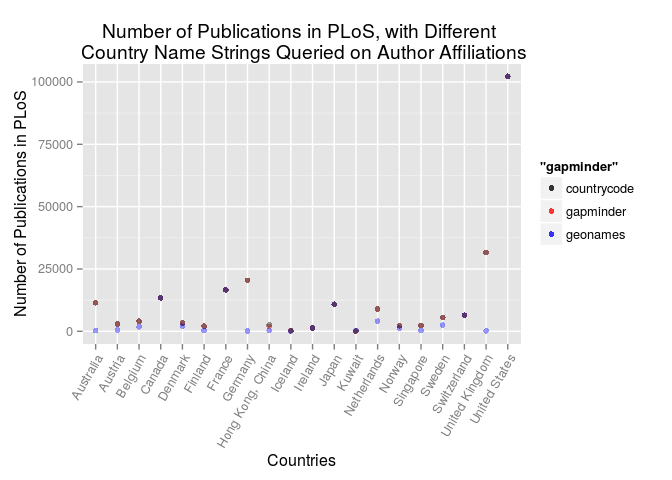 

```r
ggsave("countrypubs.png", scale = 0.8)
```

```
## Saving 5.6 x 4 in image
```

And now again with better scaling:


Well, fortunately from what it looks like, the gapminder & countrycode names are giving us the same results, with geonames resulting in far fewer hits. 

```r
QueryCountries2 <- head(GapAndGeo, 50)
QueryCountries2$country <- droplevels(QueryCountries2$country)
QueryCountries2$continent.y <- droplevels(QueryCountries2$continent.y)
str(QueryCountries2)
```

```
## 'data.frame':	50 obs. of  23 variables:
##  $ continent.x  : chr  "EU" "AS" "AS" "NA" ...
##  $ capital      : chr  "Oslo" "Kuwait City" "Singapore" "Washington, D. C." ...
##  $ languages    : chr  "no,nb,nn,se,fi" "ar-KW,en" "cmn,en-SG,ms-SG,ta-SG,zh-SG" "en-US,es-US,haw,fr" ...
##  $ geonameId    : chr  "3144096" "285570" "1880251" "6252001" ...
##  $ south        : chr  "57.977917" "28.524611" "1.258556" "24.544245" ...
##  $ isoAlpha3    : chr  "NOR" "KWT" "SGP" "USA" ...
##  $ north        : chr  "71.18811" "30.095945" "1.471278" "49.388611" ...
##  $ fipsCode     : chr  "NO" "KU" "SN" "US" ...
##  $ population   : chr  "5009150" "2789132" "4701069" "310232863" ...
##  $ east         : chr  "31.078052520752" "48.431473" "104.007469" "-66.954811" ...
##  $ isoNumeric   : chr  "578" "414" "702" "840" ...
##  $ areaInSqKm   : chr  "324220.0" "17820.0" "692.7" "9629091.0" ...
##  $ countryCode  : chr  "NO" "KW" "SG" "US" ...
##  $ west         : chr  "4.650167" "46.555557" "103.638275" "-124.733253" ...
##  $ countryName  : chr  "Kingdom of Norway" "State of Kuwait" "Republic of Singapore" "United States" ...
##  $ continentName: chr  "Europe" "Asia" "Asia" "North America" ...
##  $ currencyCode : chr  "NOK" "KWD" "SGD" "USD" ...
##  $ country      : Factor w/ 50 levels "Argentina","Australia",..: 34 27 40 49 22 18 45 32 7 20 ...
##  $ continent.y  : Factor w/ 5 levels "Africa","Americas",..: 4 3 3 2 4 3 4 4 2 4 ...
##  $ year         : num  2007 2007 2007 2007 2007 ...
##  $ lifeExp      : num  80.2 77.6 80 78.2 78.9 ...
##  $ pop          : num  4.63e+06 2.51e+06 4.55e+06 3.01e+08 4.11e+06 ...
##  $ gdpPercap    : num  49357 47307 47143 42952 40676 ...
```

```r
countrypubs2 <- NULL
countrypubs2 <- data.frame(gapminderNames = QueryCountries2$country)
countrypubs2$gapminderNames <- as.character(countrypubs2$gapminderNames)
str(countrypubs2)
```

```
## 'data.frame':	50 obs. of  1 variable:
##  $ gapminderNames: chr  "Norway" "Kuwait" "Singapore" "United States" ...
```

```r
#countrypubs2$gapminderPubs <- lapply(countrypubs2$gapminderNames, FUN = pubs) %>% unlist()
#write.table(countrypubs2, "countrypubs2.tsv", sep = "\t")
countrypubs2 <- read.delim("countrypubs2.tsv")
```


```r
head(countrypubs2) %>% 
	kable("markdown")
```


|gapminderNames   | gapminderPubs|
|:----------------|-------------:|
|Norway           |          2200|
|Kuwait           |            79|
|Singapore        |          2371|
|United States    |        102271|
|Ireland          |          1279|
|Hong Kong, China |          1852|

```r
countrypubs2$gapminderNames <- as.factor(countrypubs2$gapminderNames)
countrypubs2 <- countrypubs2 %>% 
	mutate(gapminderNames = reorder(gapminderNames, gapminderPubs, max))
p <- ggplot(countrypubs2, aes())
p + geom_bar(aes(x = gapminderNames, y = gapminderPubs), stat = "identity") +
	theme(axis.text.x = element_text(angle=60, hjust=1)) + 
	xlab("Countries") +
	ylab("Number of Publications in PLoS")
```

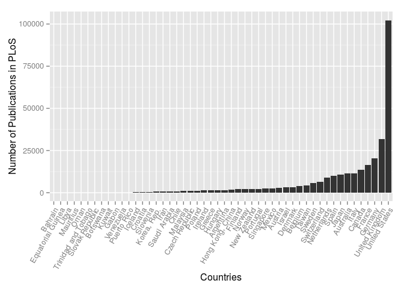 

```r
# ggsave("countrypubs50.png", scale = 0.9)
```

So that's not too bad.  Looks like we can eliminate the 13 or so countries from our query though, which would bring our total query number down to 37.  

## Let's keep going!
Alright!  So that's all pretty good so far.  What else can we do?
Let's look back at `GapAndGeo` and see what other variables we can investigate.  

```r
str(GapAndGeo)
```

```
## 'data.frame':	142 obs. of  23 variables:
##  $ continent.x  : chr  "EU" "AS" "AS" "NA" ...
##  $ capital      : chr  "Oslo" "Kuwait City" "Singapore" "Washington, D. C." ...
##  $ languages    : chr  "no,nb,nn,se,fi" "ar-KW,en" "cmn,en-SG,ms-SG,ta-SG,zh-SG" "en-US,es-US,haw,fr" ...
##  $ geonameId    : chr  "3144096" "285570" "1880251" "6252001" ...
##  $ south        : chr  "57.977917" "28.524611" "1.258556" "24.544245" ...
##  $ isoAlpha3    : chr  "NOR" "KWT" "SGP" "USA" ...
##  $ north        : chr  "71.18811" "30.095945" "1.471278" "49.388611" ...
##  $ fipsCode     : chr  "NO" "KU" "SN" "US" ...
##  $ population   : chr  "5009150" "2789132" "4701069" "310232863" ...
##  $ east         : chr  "31.078052520752" "48.431473" "104.007469" "-66.954811" ...
##  $ isoNumeric   : chr  "578" "414" "702" "840" ...
##  $ areaInSqKm   : chr  "324220.0" "17820.0" "692.7" "9629091.0" ...
##  $ countryCode  : chr  "NO" "KW" "SG" "US" ...
##  $ west         : chr  "4.650167" "46.555557" "103.638275" "-124.733253" ...
##  $ countryName  : chr  "Kingdom of Norway" "State of Kuwait" "Republic of Singapore" "United States" ...
##  $ continentName: chr  "Europe" "Asia" "Asia" "North America" ...
##  $ currencyCode : chr  "NOK" "KWD" "SGD" "USD" ...
##  $ country      : Factor w/ 142 levels "Afghanistan",..: 96 72 114 135 63 56 124 91 21 58 ...
##  $ continent.y  : Factor w/ 5 levels "Africa","Americas",..: 4 3 3 2 4 3 4 4 2 4 ...
##  $ year         : num  2007 2007 2007 2007 2007 ...
##  $ lifeExp      : num  80.2 77.6 80 78.2 78.9 ...
##  $ pop          : num  4.63e+06 2.51e+06 4.55e+06 3.01e+08 4.11e+06 ...
##  $ gdpPercap    : num  49357 47307 47143 42952 40676 ...
```

Hmm, `population` (and `pop`), `areaInSqKm`, and `lifeExp` all look like interesting factors to investigate.  Let's:
- Open up our list of top 50 and trim it down to 37
- Select the four factors from above along with `gdpPercap`
- Join it to our publication numbers set

```r
CorrInvest <- head(GapAndGeo, 37)
CorrInvest <- CorrInvest %>% 
	select("gapminderNames" = country, population, pop, areaInSqKm, lifeExp, gdpPercap)
CorrInvest$gapminderNames <- droplevels(CorrInvest$gapminderNames)
str(CorrInvest)
```

```
## 'data.frame':	37 obs. of  6 variables:
##  $ gapminderNames: Factor w/ 37 levels "Australia","Austria",..: 23 20 28 37 15 12 33 21 5 14 ...
##  $ population    : chr  "5009150" "2789132" "4701069" "310232863" ...
##  $ pop           : num  4.63e+06 2.51e+06 4.55e+06 3.01e+08 4.11e+06 ...
##  $ areaInSqKm    : chr  "324220.0" "17820.0" "692.7" "9629091.0" ...
##  $ lifeExp       : num  80.2 77.6 80 78.2 78.9 ...
##  $ gdpPercap     : num  49357 47307 47143 42952 40676 ...
```

```r
CorrInvest <- inner_join(CorrInvest, countrypubs2)
```

```
## Joining by: "gapminderNames"
```

```
## Warning in inner_join_impl(x, y, by$x, by$y): joining factors with
## different levels, coercing to character vector
```

Perfect, `inner_join` even coerces the factors to characters for us!  Let's get started. 

```r
p <- ggplot(CorrInvest, aes(x = population, y = gapminderPubs))
p + geom_point() +
	ggtitle("Number of Publications versus Country Population") +
	xlab("Country Population") +
	ylab("Number of Publications") +
	theme(axis.text.x = element_text(angle=60, hjust=1))
```

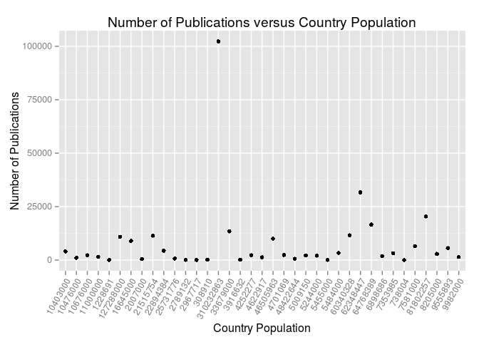 

Whoops! Looks likes the population was a character, not numeric. Let's take care of that. 

```r
CorrInvest$population <- as.numeric(CorrInvest$population)
CorrInvest$areaInSqKm <- as.numeric(CorrInvest$areaInSqKm)
class(CorrInvest$population)
```

```
## [1] "numeric"
```

```r
class(CorrInvest$areaInSqKm)
```

```
## [1] "numeric"
```

Okay, let's try that again!

```r
p <- ggplot(CorrInvest, aes(x = population, y = gapminderPubs))
p + geom_point(alpha = 0.5, shape = 18, size = 3.6) +
	geom_smooth(method = lm) +
	ggtitle("Number of Publications versus Country Population") +
	xlab("Country Population") +
	ylab("Number of Publications")
```

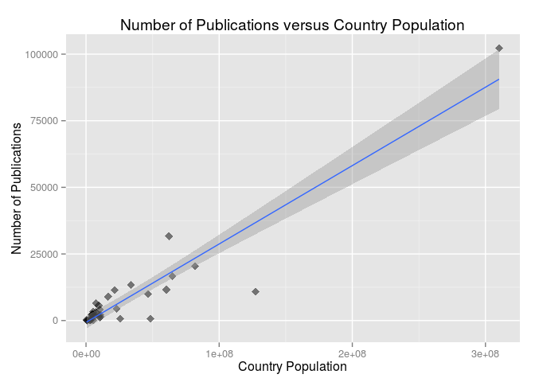 

Well, that's quite the outlier!  I have a feeling that's the United States. Our correlation looks pretty linear though. Let's just remove the US for a moment.  

```r
CorrInvest %>% 
	filter(gapminderNames != "United States") %>% 
	ggplot(aes(x = population, y = gapminderPubs)) +
	geom_point(alpha = 0.5, shape = 18, size = 3.6) +
	geom_smooth(method = lm) +
	ggtitle("Number of Publications versus Country Population") +
	xlab("Country Population") +
	ylab("Number of Publications")
```

 

That looks a little more interesting. Let's keep going! As a reminder, we've got:  
`population` (and `pop`), `areaInSqKm`, and `lifeExp`, `gdpPercap`

```r
p <- ggplot(CorrInvest, aes(x = areaInSqKm, y = gapminderPubs))
p + geom_point(alpha = 0.5, shape = 18, size = 3.6) +
	geom_smooth(method = lm) +
	ggtitle("Number of Publications versus Country Area") +
	xlab("Area of Country in Square Kilometers") +
	ylab("Number of Publications")
```

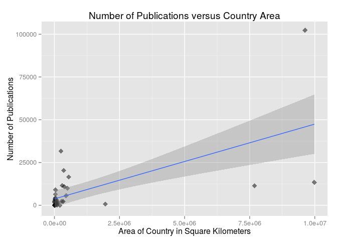 

What an odd plot.  Perhaps we should look at each of these variables in one dimension briefly.  

```r
p <- ggplot(CorrInvest, aes(x = gapminderPubs))
p + geom_histogram(binwidth = 1000) +
	ylab("Number of Publications") +
	xlab("Frequency") +
	ggtitle("Frequency Distribution of Number of Publications from at \n Least One Author per Article Affiliated with a Specific Country \n from top 37 Countries in Gapminder Project by GDP Per Capita")
```

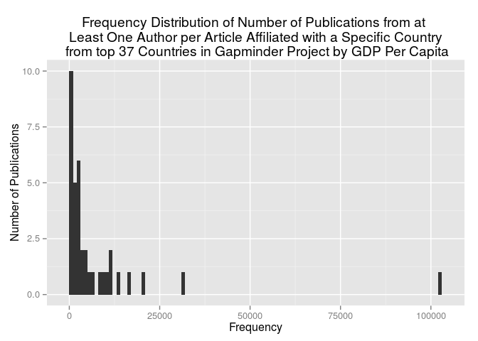 

And Country Area?

```r
p <- ggplot(CorrInvest, aes(x = areaInSqKm))
p + geom_histogram(binwidth = 100000) +
	ylab("Country Area") +
	xlab("Frequency") +
	ggtitle("Frequency Distribution of Country Areas from top 37 Countries in Gapminder Project by GDP Per Capita")
```

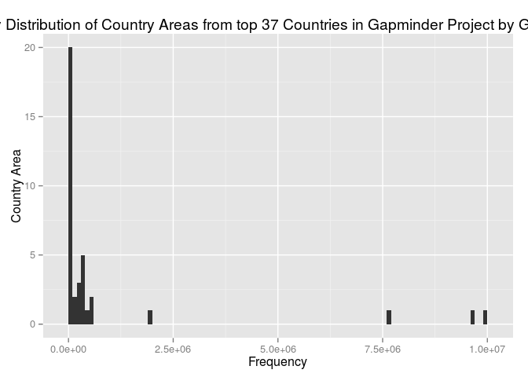 

Alright, well, we've got pretty similar distributions. Still... strange. Let's take a look at life expectancy.  

```r
p <- ggplot(CorrInvest, aes(x = lifeExp, y = gapminderPubs))
p + geom_point(alpha = 0.5, shape = 18, size = 3.6) +
	geom_smooth(method = lm) +
	ggtitle("Number of Publications versus Country's Life Expectancy in 2007") +
	xlab("Life Expectancy in 2007") +
	ylab("Number of Publications")
```

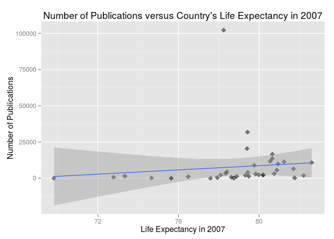 

Ah, now that's interesting!  Almost no correlation.  And the US isn't doing so well in this category.  
One last thing I want to look at is the population derived from `geonames` (presumably more recent) versus the country population from `gapminder` in 2007.  

```r
p <- ggplot(CorrInvest, aes(x = pop, y = population))
p + geom_point(alpha = 0.5, shape = 18, size = 3.6) +
	geom_smooth(method = lm) +
	ggtitle("Population in 2007 versus Geonames Population") +
	xlab("Population in 2007") +
	ylab("Geonames Population")
```

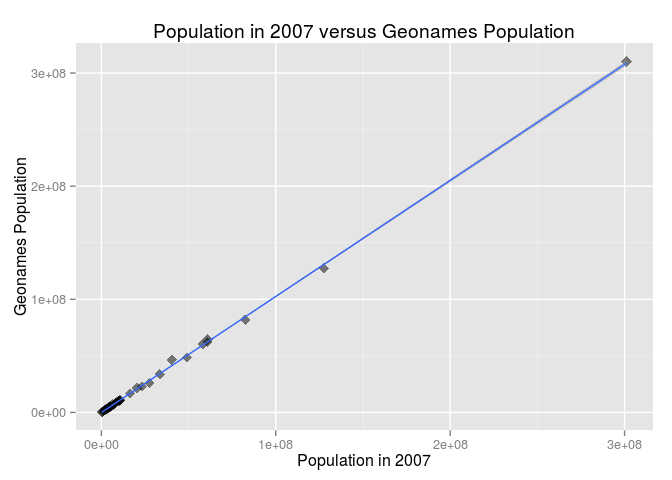 

Wonderful, just what I was hoping for! Extremely tight correlation here.  

```r
pops <- CorrInvest %>% 
	select("country" = gapminderNames, "gapminder" = pop, "geonames" = population)
str(pops)
```

```
## 'data.frame':	37 obs. of  3 variables:
##  $ country  : chr  "Norway" "Kuwait" "Singapore" "United States" ...
##  $ gapminder: num  4.63e+06 2.51e+06 4.55e+06 3.01e+08 4.11e+06 ...
##  $ geonames : num  5.01e+06 2.79e+06 4.70e+06 3.10e+08 4.62e+06 ...
```

```r
pops <- pops %>% 
	mutate(growth = geonames - gapminder)
pops <- pops %>% 
	mutate(country = reorder(country, growth, max))
```

Finally, looking at population growth

```r
p <- ggplot(pops, aes(x = country, y = growth))
p + geom_bar(stat = "identity") +
	ggtitle("Population Growth in Top 37 Countries by GDP Per Capita") +
	xlab("Country") +
	ylab("Population Change since 2007") +
	theme(axis.text.x = element_text(angle=60, hjust=1)) +
	scale_y_continuous(labels = scientific, breaks = seq(-2500000, 10000000, 1000000))
```

```
## Warning: Stacking not well defined when ymin != 0
```

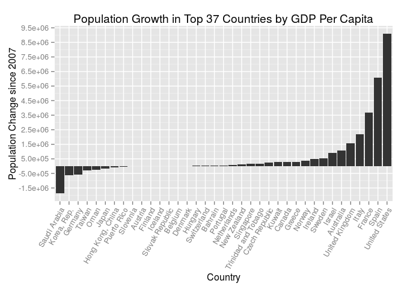 

## How about some scraping?  
Note that I actually found it easier to use Google Chrome's "Inspect Element" feature here over the Chrome extension "SelectorGadget", I've included a screenshot:
  
******  
- It's incredibly easy to right click the table -> "Inspect Element"  
- Then find the table within the nicely laid out HTML code on the right and right click -> "Copy XPath"  
- Finally, paste the xpath in single quotes to `html_node(xpath = '')`!  

```r
wikispending <- read_html("https://en.wikipedia.org/wiki/List_of_countries_by_research_and_development_spending") %>% 
	html_node(xpath = '//*[@id="mw-content-text"]/table[1]') %>% 
	html_table()
str(wikispending)
```

```
## 'data.frame':	72 obs. of  7 variables:
##  $ Rank                                        : int  1 2 3 4 5 6 7 8 9 10 ...
##  $ Country/Region                              : chr  " United States" " China" " Japan" " Germany" ...
##  $ Expenditures on R&D
## (billions of US$, PPP),: chr  "405.3" "337.5" "160.3" "69.5" ...
##  $  % of GDP PPP                               : chr  "2.7%" "2.08%" "3.67%" "2.3%" ...
##  $ Expenditures on R&D per capita
## (US$ PPP),  : chr  "1,275.64" "248.16" "1,260.42" "861.04" ...
##  $ Year                                        : int  2011 2013 2011 2011 2012 2013 2011 2011 2013 2011 ...
##  $ Source                                      : chr  "[2]" "[3]" "[4]" "[2]" ...
```

```r
wikispending$Source <- NULL
wikispending$Rank <- NULL
colnames(wikispending) <- c("country", "expenditure", "percentofGDP", "expenditurePerCapita", "year")
wikispending <- tbl_df(wikispending)
wikispending %>% 
	head() %>% 
	kable("markdown")
```


|country        |expenditure |percentofGDP |expenditurePerCapita | year|
|:--------------|:-----------|:------------|:--------------------|----:|
| United States |405.3       |2.7%         |1,275.64             | 2011|
| China         |337.5       |2.08%        |248.16               | 2013|
| Japan         |160.3       |3.67%        |1,260.42             | 2011|
| Germany       |69.5        |2.3%         |861.04               | 2011|
| South Korea   |65.4        |4.36%        |1,307.90             | 2012|
| India         |44          |0.9%         |37                   | 2013|


```r
countrypubs2 <- tbl_df(countrypubs2)
colnames(countrypubs2)[1] <- "country"
countrypubs2$country <- as.character(countrypubs2$country)
head(countrypubs2) %>% 
	kable("markdown")
```


|country          | gapminderPubs|
|:----------------|-------------:|
|Norway           |          2200|
|Kuwait           |            79|
|Singapore        |          2371|
|United States    |        102271|
|Ireland          |          1279|
|Hong Kong, China |          1852|

```r
head(wikispending) %>% 
	kable("markdown")
```


|country        |expenditure |percentofGDP |expenditurePerCapita | year|
|:--------------|:-----------|:------------|:--------------------|----:|
| United States |405.3       |2.7%         |1,275.64             | 2011|
| China         |337.5       |2.08%        |248.16               | 2013|
| Japan         |160.3       |3.67%        |1,260.42             | 2011|
| Germany       |69.5        |2.3%         |861.04               | 2011|
| South Korea   |65.4        |4.36%        |1,307.90             | 2012|
| India         |44          |0.9%         |37                   | 2013|

```r
wikicorr <- inner_join(wikispending, countrypubs2, by = "country")
str(wikicorr)
```

```
## Classes 'tbl_df', 'tbl' and 'data.frame':	0 obs. of  6 variables:
##  $ country             : chr 
##  $ expenditure         : chr 
##  $ percentofGDP        : chr 
##  $ expenditurePerCapita: chr 
##  $ year                : int 
##  $ gapminderPubs       : int
```

That's so weird! What's going on here?

```r
str(wikispending$country)
```

```
##  chr [1:72] " United States" " China" " Japan" " Germany" ...
```

Ahh, it looks like `rvest` is scraping the Country strings with an extra blank in front of the character string. Can we solve this problem with regex & gsub?

```r
wikispending$country <- gsub("^.{1}", "", wikispending$country)
head(wikispending$country)
```

```
## [1] "United States" "China"         "Japan"         "Germany"      
## [5] "South Korea"   "India"
```

Now for some reason, trying to remove just leading whitespace (`gsub("^\\s+", "", x)`) was NOT working!! So, I just removed the first character, which in this case was one blank space for each. 

```r
as.numeric(wikispending$expenditure)
```

```
## Warning: NAs introduced by coercion
```

```
##  [1] 405.300 337.500 160.300  69.500  65.400  44.000  42.200  38.400
##  [9]      NA  24.300  19.400  19.000  19.000  17.200  15.900  11.900
## [17]  10.800  11.600   8.300   7.500   7.249   6.900   6.900   6.400
## [25]   6.300   6.300   5.100   4.200   3.800   3.700   2.800   2.750
## [33]      NA   2.700   2.600   2.600   1.800   1.700   1.700   1.460
## [41]   1.400   1.300   1.220   1.020   0.910   0.800   0.760   0.720
## [49]   0.700      NA   0.670   0.660   0.600   0.520   0.500   0.470
## [57]   0.440   0.380   0.360   0.300   0.290   0.272   0.250   0.240
## [65]   0.230   0.180   0.160   0.150   0.130   0.110   0.110   0.100
```

Huh, wait a second. Why are there NAs being introduced? Let's roll that change back...

```r
wikispending$expenditure
```

```
##  [1] "405.3"  "337.5"  "160.3"  "69.5"   "65.4"   "44"     "42.2"  
##  [8] "38.4"   "32.8n1" "24.3"   "19.4"   "19.0"   "19.0"   "17.2"  
## [15] "15.9"   "11.9"   "10.8"   "11.6"   "8.3"    "7.5"    "7.249" 
## [22] "6.9"    "6.9"    "6.4"    "6.3"    "6.3"    "5.1"    "4.2"   
## [29] "3.8"    "3.7"    "2.8"    "2.75"   "2.73n2" "2.7"    "2.6"   
## [36] "2.6"    "1.8"    "1.7"    "1.7"    "1.46"   "1.4"    "1.3"   
## [43] "1.22"   "1.02"   "0.91"   "0.8"    "0.76"   "0.72"   "0.7"   
## [50] "0.7 n3" "0.67"   "0.66"   "0.6"    "0.52"   "0.5"    "0.47"  
## [57] "0.44"   "0.38"   "0.36"   "0.3"    "0.29"   "0.272"  "0.25"  
## [64] "0.24"   "0.23"   "0.18"   "0.16"   "0.15"   "0.13"   "0.11"  
## [71] "0.11"   "0.1"
```

Ahhh, it looks like there were some abberent footnotes I'll need to clean out of the scraped data.

```r
wikispending$expenditure <- gsub("n[0-9]*$", "", wikispending$expenditure)
wikispending$expenditure <- as.numeric(wikispending$expenditure)
```

Glancing back at the wikipedia table, it looks like this is the only instance.  Seems as though I'll have to pull the percent signs from the `percentofGDP` column though!

```r
wikispending$percentofGDP <- gsub("%$", "", wikispending$percentofGDP)
wikispending$percentofGDP <- as.numeric(wikispending$percentofGDP)
```

But we should coerce `expenditurePerCapita` and `percentofGDP` to numeric as well! First we need to remove commas from `expenditurePerCapita`

```r
wikispending$expenditurePerCapita <- gsub(",", "", wikispending$expenditurePerCapita)
wikispending$expenditurePerCapita <- as.numeric(wikispending$expenditurePerCapita)
str(wikispending)
```

```
## Classes 'tbl_df', 'tbl' and 'data.frame':	72 obs. of  5 variables:
##  $ country             : chr  "United States" "China" "Japan" "Germany" ...
##  $ expenditure         : num  405.3 337.5 160.3 69.5 65.4 ...
##  $ percentofGDP        : num  2.7 2.08 3.67 2.3 4.36 0.9 1.9 1.7 1 1.8 ...
##  $ expenditurePerCapita: num  1276 248 1260 861 1308 ...
##  $ year                : int  2011 2013 2011 2011 2012 2013 2011 2011 2013 2011 ...
```

Now time to join!

```r
wikicorr <- inner_join(wikispending, countrypubs2, by = "country")
str(wikicorr)
```

```
## Classes 'tbl_df', 'tbl' and 'data.frame':	36 obs. of  6 variables:
##  $ country             : chr  "United States" "Japan" "Germany" "France" ...
##  $ expenditure         : num  405.3 160.3 69.5 42.2 38.4 ...
##  $ percentofGDP        : num  2.7 3.67 2.3 1.9 1.7 1.8 1.1 2.3 1.3 1.7 ...
##  $ expenditurePerCapita: num  1276 1260 861 641 603 ...
##  $ year                : int  2011 2011 2011 2011 2011 2011 2011 2011 2011 2011 ...
##  $ gapminderPubs       : int  102271 10839 20412 16614 31680 13416 11591 4361 9975 11426 ...
```

Alright, now we're cooking!

```r
p <- ggplot(wikicorr, aes(x = expenditure, y = gapminderPubs))
p + geom_point(alpha = 0.5, shape = 18, size = 3.6) +
	geom_smooth(method = lm) +
	ggtitle("Number of Publications versus Country Expenditure on R&D") +
	xlab("Expenditure on R&D (Billions of USD)") +
	ylab("Number of Publications")
```

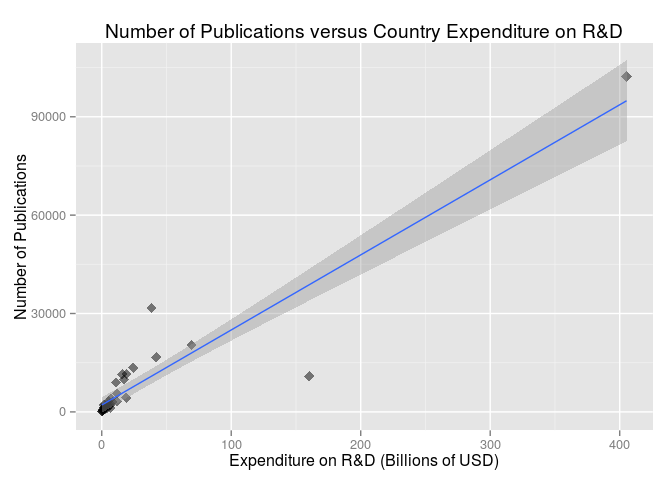 

Okay, well that's pretty obvious.  How about adding in some more data?

```r
colnames(CorrInvest)[1] <- "country"
CorrInvest$pop <- NULL
wikicorr <- inner_join(CorrInvest, wikicorr)
```

```
## Joining by: c("country", "gapminderPubs")
```

```r
str(wikicorr)
```

```
## 'data.frame':	28 obs. of  10 variables:
##  $ country             : chr  "Norway" "Singapore" "United States" "Ireland" ...
##  $ population          : num  5.01e+06 4.70e+06 3.10e+08 4.62e+06 1.66e+07 ...
##  $ areaInSqKm          : num  324220 693 9629091 70280 41526 ...
##  $ lifeExp             : num  80.2 80 78.2 78.9 79.8 ...
##  $ gdpPercap           : num  49357 47143 42952 40676 36798 ...
##  $ gapminderPubs       : int  2200 2371 102271 1279 8935 13416 202 2910 3299 11426 ...
##  $ expenditure         : num  4.2 6.3 405.3 2.6 10.8 ...
##  $ percentofGDP        : num  1.6 2.2 2.7 1.4 1.6 1.8 2.3 2.5 2.4 1.7 ...
##  $ expenditurePerCapita: num  822 1167 1276 566 641 ...
##  $ year                : int  2011 2011 2011 2011 2011 2011 2011 2011 2011 2011 ...
```

```r
colnames(wikicorr)[6] <- "publications"
```

Great! Now we can examine more things.

```r
p <- ggplot(wikicorr, aes(x = expenditurePerCapita, y = publications))
p + geom_point(alpha = 0.5, shape = 18, size = 3.6) +
	geom_smooth(method = lm) +
	ggtitle("Number of Publications versus Expenditure on R&D per capita") +
	xlab("Expenditure on R&D per capita (USD)") +
	ylab("Number of Publications")
```

 

I'd do more, but honestly all of the correlations here are pretty obvious.  

**The United States:**  
1. Has the highest GDP  
2. Has a large population  
3. Spends the most on R&D  
4. Has the most authors on publications  

## Thanks for Reading!

