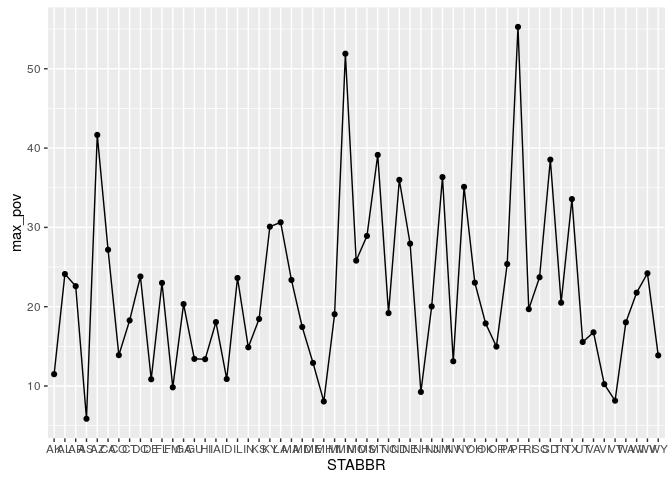
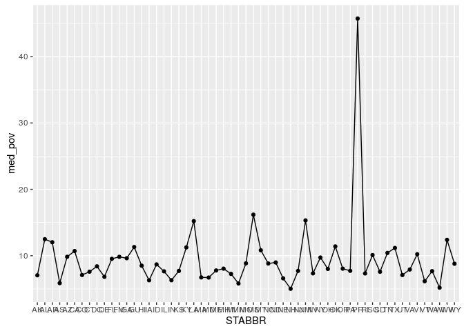
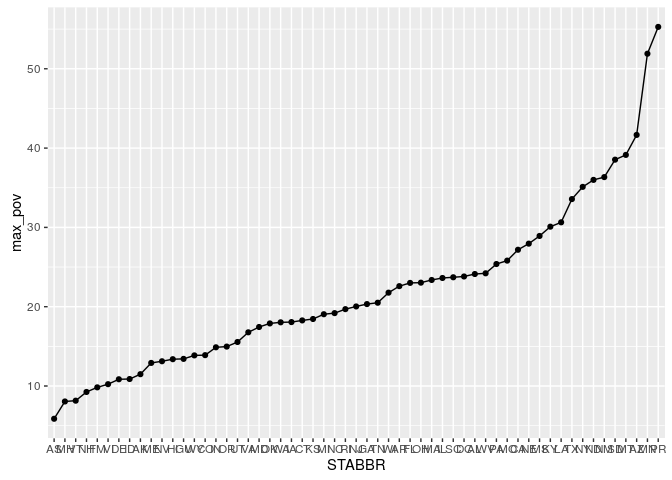
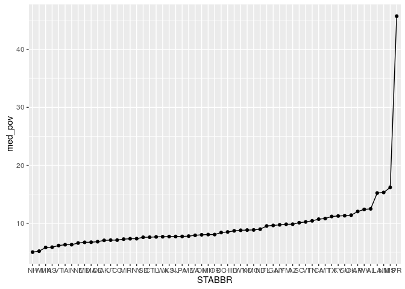
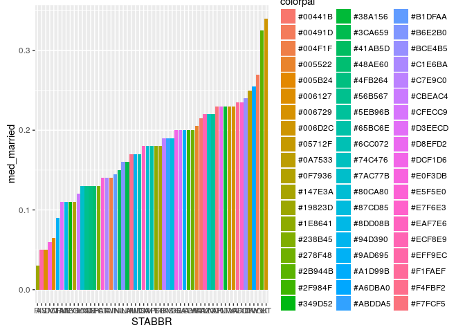
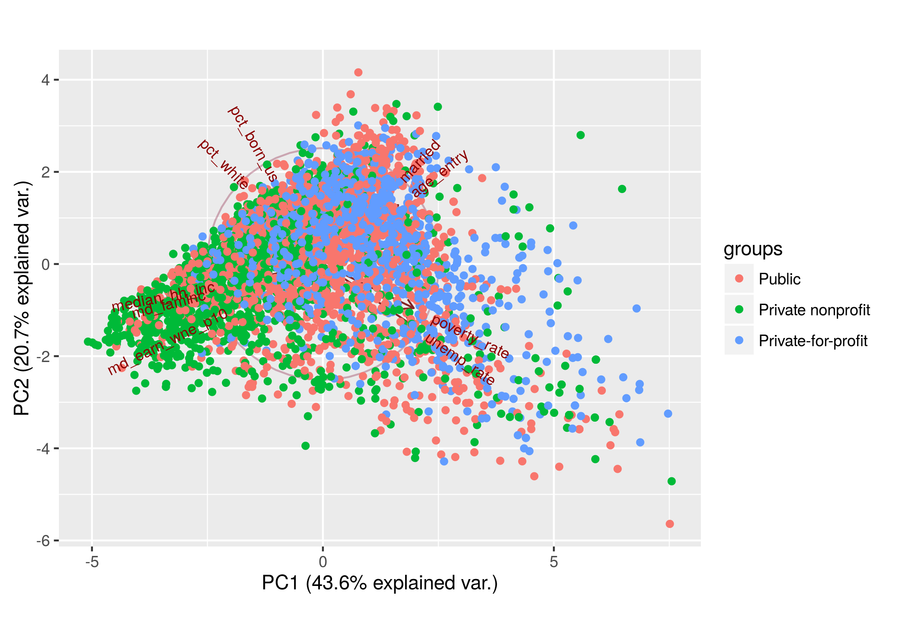
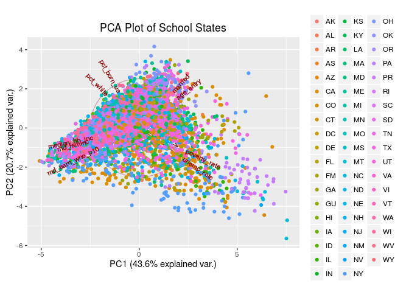
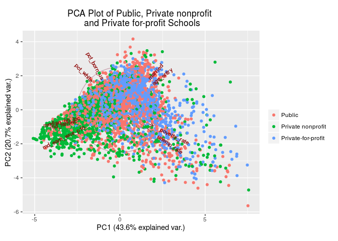

### Goals:

1. Reorder a factor in a principled way based on the data and demonstrate the effect in arranged data and in figures.
2. Remake at least one previously made figure, in light of recent coverage of visualization design principles.
3. Write a figure to file explicitly and include it your R Markdown report via ``.
4. Clean up your repo, to celebrate the completion of STAT 545 and/or to prepare for the glorious future of STAT 547.

  **Note to student evaluators:** Yes, I have gotten the OK from Jenny on working with this dataset.  


Before we dive in, let's load our dependent packages and bring in our data.  

```r
# install.packages("FactoMineR", dependencies = TRUE)
library(FactoMineR)
# devtools::install_github("vqv/ggbiplot")
suppressPackageStartupMessages(library(ggbiplot))
library(ggplot2)
library(knitr)
suppressPackageStartupMessages(library(dplyr))
library(tidyr)
library(broom)
library(maps)
```

```
##
## Attaching package: 'maps'
```

```
## The following object is masked from 'package:plyr':
##
##     ozone
```

```r
library(RColorBrewer)
# Pull the CSV from this url
PSE <- url('http://s3.amazonaws.com/ed-college-choice-public/Most+Recent+Cohorts+(Treasury+Elements).csv')
pse <- read.csv(PSE, header=TRUE, na.strings = c("NULL", "PrivacySuppressed")) %>%
  tbl_df()
SC <- url('http://s3.amazonaws.com/ed-college-choice-public/Most+Recent+Cohorts+(Scorecard+Elements).csv')
sc <- read.csv(SC, header=TRUE, na.strings = c("NULL", "PrivacySuppressed")) %>%
  tbl_df()
union <- inner_join(pse, sc)
```

```
## Joining, by = c("UNITID", "INSTNM", "md_earn_wne_p10", "gt_25k_p6")
```

```r
subunion <- union %>%
  select(INSTNM, CONTROL, age_entry, married, md_faminc, median_hh_inc, pct_white, md_earn_wne_p10, poverty_rate, unemp_rate, pct_born_us)
head(subunion) %>%
  knitr::kable("markdown")
```


|INSTNM                              | CONTROL| age_entry| married| md_faminc| median_hh_inc| pct_white| md_earn_wne_p10| poverty_rate| unemp_rate| pct_born_us|
|:-----------------------------------|-------:|---------:|-------:|---------:|-------------:|---------:|---------------:|------------:|----------:|-----------:|
|Alabama A & M University            |       1|     20.63|    0.03|   29039.0|      49720.22|     46.84|           31400|        14.88|       4.84|       94.74|
|University of Alabama at Birmingham |       1|     22.67|    0.11|   34909.0|      55735.22|     69.02|           40300|        10.91|       3.45|       96.50|
|Amridge University                  |       2|     32.82|    0.62|   30037.0|      53683.70|     70.88|           38100|        10.65|       3.60|       94.09|
|University of Alabama in Huntsville |       1|     23.19|    0.17|   39766.0|      58688.62|     76.38|           46600|         9.37|       3.64|       95.27|
|Alabama State University            |       1|     20.89|    0.03|   24029.5|      46065.20|     42.69|           27800|        16.96|       4.81|       94.53|
|The University of Alabama           |       1|     20.77|    0.05|   58976.0|      57928.41|     75.35|           42400|        10.05|       3.26|       96.08|

#### 1. Reorder a factor in a principled way based on the data and demonstrate the effect in arranged data and in figures.  

Let's take a snippet of data to work with--the entire dataset is just too wide to work with

```r
subset <- subunion %>%
  select(INSTNM, CONTROL, median_hh_inc, poverty_rate, age_entry, married)
subset %>%
  head() %>%
  kable("markdown")
```


|INSTNM                              | CONTROL| median_hh_inc| poverty_rate| age_entry| married|
|:-----------------------------------|-------:|-------------:|------------:|---------:|-------:|
|Alabama A & M University            |       1|      49720.22|        14.88|     20.63|    0.03|
|University of Alabama at Birmingham |       1|      55735.22|        10.91|     22.67|    0.11|
|Amridge University                  |       2|      53683.70|        10.65|     32.82|    0.62|
|University of Alabama in Huntsville |       1|      58688.62|         9.37|     23.19|    0.17|
|Alabama State University            |       1|      46065.20|        16.96|     20.89|    0.03|
|The University of Alabama           |       1|      57928.41|        10.05|     20.77|    0.05|

Okay, let's perform a basic `arrange()`.

```r
subset %>%
  arrange(CONTROL) %>%
  head() %>%
  kable("markdown")
```


|INSTNM                              | CONTROL| median_hh_inc| poverty_rate| age_entry| married|
|:-----------------------------------|-------:|-------------:|------------:|---------:|-------:|
|Alabama A & M University            |       1|      49720.22|        14.88|     20.63|    0.03|
|University of Alabama at Birmingham |       1|      55735.22|        10.91|     22.67|    0.11|
|University of Alabama in Huntsville |       1|      58688.62|         9.37|     23.19|    0.17|
|Alabama State University            |       1|      46065.20|        16.96|     20.89|    0.03|
|The University of Alabama           |       1|      57928.41|        10.05|     20.77|    0.05|
|Central Alabama Community College   |       1|      43985.14|        13.55|     25.64|    0.25|

Okay, so that works.  But I think it's important to note that we can use the non-standard evaluation `arrange_()` on a character string for the column name.

```r
subset %>%
  arrange_("CONTROL") %>%
  head() %>%
  kable("markdown")
```


|INSTNM                              | CONTROL| median_hh_inc| poverty_rate| age_entry| married|
|:-----------------------------------|-------:|-------------:|------------:|---------:|-------:|
|Alabama A & M University            |       1|      49720.22|        14.88|     20.63|    0.03|
|University of Alabama at Birmingham |       1|      55735.22|        10.91|     22.67|    0.11|
|University of Alabama in Huntsville |       1|      58688.62|         9.37|     23.19|    0.17|
|Alabama State University            |       1|      46065.20|        16.96|     20.89|    0.03|
|The University of Alabama           |       1|      57928.41|        10.05|     20.77|    0.05|
|Central Alabama Community College   |       1|      43985.14|        13.55|     25.64|    0.25|

Let's move on to `reorder()`, how does that work? According to the documentation, it "reorders its levels".  

```r
glimpse(subset)
```

```
## Observations: 7,804
## Variables: 6
## $ INSTNM        <fctr> Alabama A & M University, University of Alabama...
## $ CONTROL       <int> 1, 1, 2, 1, 1, 1, 1, 1, 1, 1, 2, 1, 2, 3, 1, 1, ...
## $ median_hh_inc <dbl> 49720.22, 55735.22, 53683.70, 58688.62, 46065.20...
## $ poverty_rate  <dbl> 14.88, 10.91, 10.65, 9.37, 16.96, 10.05, 13.55, ...
## $ age_entry     <dbl> 20.63, 22.67, 32.82, 23.19, 20.89, 20.77, 25.64,...
## $ married       <dbl> 0.03, 0.11, 0.62, 0.17, 0.03, 0.05, 0.25, 0.46, ...
```

I'll have to use INSTNM instead of CONTROL because it's the only factor in my data set!

```r
reorder(x = subset$INSTNM) %>%
  head() %>%
  kable("markdown")
```

```
## Error in tapply(X = X, INDEX = x, FUN = FUN, ...): argument "X" is missing, with no default
```

This doesn't seem to work, but even if it did it wouldn't be very useful, since `nrow(subset)` is nearly equal to `length(unique(levels(subset$INSTNM)))`.  

```r
nrow(subset)
```

```
## [1] 7804
```

```r
length(unique(levels(subset$INSTNM)))
```

```
## [1] 7634
```

It'd be great if we could go by state name! Let's pull the state abbreviations for this exercise.  Unfortunately this is a pretty big file

```r
recent <- url('http://s3.amazonaws.com/ed-college-choice-public/Most+Recent+Cohorts+(All+Data+Elements).csv')
recent <- read.csv(SC, header=TRUE, na.strings = c("NULL", "PrivacySuppressed")) %>%
  tbl_df()
```

Now let's make this into a MUCH smaller subset so that we can join just the state abbreviations (STABBR), and perhaps the Accrediting Agency for the college as well.

```r
recent_subset <- recent %>%
  select(UNITID, INSTNM, STABBR, AccredAgency)
full_picture <- inner_join(subset, recent_subset)
```

```
## Joining, by = "INSTNM"
```

```r
full_picture %>%
  head() %>%
  kable("markdown")
```


|INSTNM                              | CONTROL| median_hh_inc| poverty_rate| age_entry| married| UNITID|STABBR |AccredAgency                                                        |
|:-----------------------------------|-------:|-------------:|------------:|---------:|-------:|------:|:------|:-------------------------------------------------------------------|
|Alabama A & M University            |       1|      49720.22|        14.88|     20.63|    0.03| 100654|AL     |Southern Association of Colleges and Schools Commission on Colleges |
|University of Alabama at Birmingham |       1|      55735.22|        10.91|     22.67|    0.11| 100663|AL     |Southern Association of Colleges and Schools Commission on Colleges |
|Amridge University                  |       2|      53683.70|        10.65|     32.82|    0.62| 100690|AL     |Southern Association of Colleges and Schools Commission on Colleges |
|University of Alabama in Huntsville |       1|      58688.62|         9.37|     23.19|    0.17| 100706|AL     |Southern Association of Colleges and Schools Commission on Colleges |
|Alabama State University            |       1|      46065.20|        16.96|     20.89|    0.03| 100724|AL     |Southern Association of Colleges and Schools Commission on Colleges |
|The University of Alabama           |       1|      57928.41|        10.05|     20.77|    0.05| 100751|AL     |Southern Association of Colleges and Schools Commission on Colleges |

```r
glimpse(full_picture)
```

```
## Observations: 8,404
## Variables: 9
## $ INSTNM        <fctr> Alabama A & M University, University of Alabama...
## $ CONTROL       <int> 1, 1, 2, 1, 1, 1, 1, 1, 1, 1, 2, 1, 2, 3, 1, 1, ...
## $ median_hh_inc <dbl> 49720.22, 55735.22, 53683.70, 58688.62, 46065.20...
## $ poverty_rate  <dbl> 14.88, 10.91, 10.65, 9.37, 16.96, 10.05, 13.55, ...
## $ age_entry     <dbl> 20.63, 22.67, 32.82, 23.19, 20.89, 20.77, 25.64,...
## $ married       <dbl> 0.03, 0.11, 0.62, 0.17, 0.03, 0.05, 0.25, 0.46, ...
## $ UNITID        <int> 100654, 100663, 100690, 100706, 100724, 100751, ...
## $ STABBR        <fctr> AL, AL, AL, AL, AL, AL, AL, AL, AL, AL, AL, AL,...
## $ AccredAgency  <fctr> Southern Association of Colleges and Schools Co...
```

Now we can go ahead and order our data table based on some more meaningful things than the alphabet.  Let's try `reorder()` again with the state abbreviations.  First let's make our initial unordered plots.  
First with the maximum poverty rate in each state.

```r
str(full_picture)
```

```
## Classes 'tbl_df', 'tbl' and 'data.frame':	8404 obs. of  9 variables:
##  $ INSTNM       : Factor w/ 7634 levels "Aaniiih Nakoda College",..: 96 6832 240 6833 99 6568 1111 400 418 417 ...
##  $ CONTROL      : int  1 1 2 1 1 1 1 1 1 1 ...
##  $ median_hh_inc: num  49720 55735 53684 58689 46065 ...
##  $ poverty_rate : num  14.88 10.91 10.65 9.37 16.96 ...
##  $ age_entry    : num  20.6 22.7 32.8 23.2 20.9 ...
##  $ married      : num  0.03 0.11 0.62 0.17 0.03 ...
##  $ UNITID       : int  100654 100663 100690 100706 100724 100751 100760 100812 100830 100858 ...
##  $ STABBR       : Factor w/ 59 levels "AK","AL","AR",..: 2 2 2 2 2 2 2 2 2 2 ...
##  $ AccredAgency : Factor w/ 118 levels "Accreditation Commission for Acupuncture and Oriental Medicine",..: 112 112 112 112 112 112 112 112 112 112 ...
```

```r
full_picture <- na.omit(full_picture)
state_max <- full_picture %>%
  group_by(STABBR) %>%
  summarize(max_pov = max(poverty_rate))
state_max
```

```
## # A tibble: 57 × 2
##    STABBR max_pov
##    <fctr>   <dbl>
## 1      AK   11.49
## 2      AL   24.12
## 3      AR   22.59
## 4      AS    5.87
## 5      AZ   41.66
## 6      CA   27.18
## 7      CO   13.89
## 8      CT   18.27
## 9      DC   23.81
## 10     DE   10.85
## # ... with 47 more rows
```

```r
ggplot(state_max, aes(x = STABBR, y = max_pov, group = 1)) +
  geom_path() + geom_point()
```

<!-- -->

Now with the mean poverty rate in each state

```r
state_med <- full_picture %>%
  group_by(STABBR) %>%
  summarize(med_pov = median(poverty_rate))
ggplot(state_med, aes(x = STABBR, y = med_pov, group = 1)) +
  geom_path() + geom_point()
```

<!-- -->

Okay, now let's reorder the factors to something more meaningful! Let's go by poverty rate since that's what we're measuring.  That initial plot was jumping all over the place and was only ordered alphabetically!

```r
Rpict <- full_picture %>%
  mutate(STABBR = reorder(STABBR, poverty_rate, max))
data.frame(before = levels(full_picture$STABBR), after = levels(Rpict$STABBR))
```

```
##    before after
## 1      AK    AS
## 2      AL    MH
## 3      AR    VT
## 4      AS    NH
## 5      AZ    FM
## 6      CA    VI
## 7      CO    DE
## 8      CT    ID
## 9      DC    AK
## 10     DE    ME
## 11     FL    NV
## 12     FM    HI
## 13     GA    GU
## 14     GU    WY
## 15     HI    CO
## 16     IA    IN
## 17     ID    OR
## 18     IL    UT
## 19     IN    VA
## 20     KS    MD
## 21     KY    OK
## 22     LA    WA
## 23     MA    IA
## 24     MD    CT
## 25     ME    KS
## 26     MH    MI
## 27     MI    NC
## 28     MN    RI
## 29     MO    NJ
## 30     MP    GA
## 31     MS    TN
## 32     MT    WI
## 33     NC    AR
## 34     ND    FL
## 35     NE    OH
## 36     NH    MA
## 37     NJ    IL
## 38     NM    SC
## 39     NV    DC
## 40     NY    AL
## 41     OH    WV
## 42     OK    PA
## 43     OR    MO
## 44     PA    CA
## 45     PR    NE
## 46     PW    MS
## 47     RI    KY
## 48     SC    LA
## 49     SD    TX
## 50     TN    NY
## 51     TX    ND
## 52     UT    NM
## 53     VA    SD
## 54     VI    MT
## 55     VT    AZ
## 56     WA    MN
## 57     WI    PR
## 58     WV    MP
## 59     WY    PW
```

```r
Rstate <- state_max %>%
  mutate(STABBR = reorder(STABBR, max_pov, FUN = max))
```


And now the figure again

```r
ggplot(Rstate, aes(x = STABBR, y = max_pov, group = 1)) +
  geom_point() + geom_line()
```

<!-- -->

And our next figure?

```r
Mstate <- state_med %>%
  mutate(STABBR = reorder(STABBR, med_pov, FUN = median))
ggplot(Mstate, aes(x = STABBR, y = med_pov, group = 1)) +
  geom_point() + geom_line()
```

<!-- -->
#### 2. Remake at least one previously made figure, in light of recent coverage of visualization design principles.

I'd like to use a continuous variable with a saturation or luminance gradient to illustrate a spectrum.

I would have liked to use states, but that'll take too long right now, I'll have to come back to this another time.  

```r
us_state_map = map_data('state')
class(us_state_map)
```

```
## [1] "data.frame"
```

```r
ggplot(us_state_map, aes(x = long, y = lat, group = group)) +
    # geom_polygon(aes(fill = cut_number(rate, 5))) +
     geom_path(colour = 'gray', linestyle = 2)
```

```
## Error: Unknown parameters: linestyle
```

```r
# ggplot(Rpict, aes(map_id = STABBR)) + geom_map(aes(fill = poverty_rate), map = us_state_map) + expand_limits(x = us_state_map$long, y = us_state_map$lat)
```

How about something more simple?  Perhaps just a gradient based system using a predefined color palette.  

```r
state_married <- full_picture %>%
  group_by(STABBR) %>%
  summarize(med_married = median(married))
brewer <- brewer.pal(n = 9, "Greens") %>%
  colorRampPalette()
colorpal <- brewer(length(state_married$med_married))
```

And on to the plot...

```r
state_married %>%
  mutate(STABBR = reorder(STABBR, med_married, FUN = median)) %>%
ggplot(aes(x = STABBR, y = med_married)) +
  geom_bar(stat = "identity", aes(fill = colorpal))
```

<!-- -->

#### 3. Write a figure to file explicitly and include it your R Markdown report via ``.  


Does the exclamation point need to be included?  
[PCA Plot](PCAplot_school-type.png)

Looks like the exclamation point allows the embed rather than a link.  

#### 4. Clean up your repo to prepare for the glorious future of STAT 547.  
Already done!

#### 5. Bonus: PCA Plots!
Let's try a PCA plot of these data

```r
subsetA <- subunion %>%
   select(INSTNM, CONTROL, age_entry, married, md_faminc, median_hh_inc, pct_white, md_earn_wne_p10, poverty_rate, unemp_rate, pct_born_us)
subsetA <- inner_join(subsetA, recent_subset) %>%
  na.omit()
```

```
## Joining, by = "INSTNM"
```

```r
glimpse(subsetA)
```

```
## Observations: 4,129
## Variables: 14
## $ INSTNM          <fctr> Alabama A & M University, University of Alaba...
## $ CONTROL         <int> 1, 1, 2, 1, 1, 1, 1, 1, 1, 1, 2, 1, 2, 1, 1, 2...
## $ age_entry       <dbl> 20.63, 22.67, 32.82, 23.19, 20.89, 20.77, 25.6...
## $ married         <dbl> 0.03, 0.11, 0.62, 0.17, 0.03, 0.05, 0.25, 0.46...
## $ md_faminc       <dbl> 29039.0, 34909.0, 30037.0, 39766.0, 24029.5, 5...
## $ median_hh_inc   <dbl> 49720.22, 55735.22, 53683.70, 58688.62, 46065....
## $ pct_white       <dbl> 46.84, 69.02, 70.88, 76.38, 42.69, 75.35, 71.5...
## $ md_earn_wne_p10 <int> 31400, 40300, 38100, 46600, 27800, 42400, 2710...
## $ poverty_rate    <dbl> 14.88, 10.91, 10.65, 9.37, 16.96, 10.05, 13.55...
## $ unemp_rate      <dbl> 4.84, 3.45, 3.60, 3.64, 4.81, 3.26, 3.76, 3.38...
## $ pct_born_us     <dbl> 94.74, 96.50, 94.09, 95.27, 94.53, 96.08, 98.8...
## $ UNITID          <int> 100654, 100663, 100690, 100706, 100724, 100751...
## $ STABBR          <fctr> AL, AL, AL, AL, AL, AL, AL, AL, AL, AL, AL, A...
## $ AccredAgency    <fctr> Southern Association of Colleges and Schools ...
```

```r
state <- subsetA$STABBR
agency <- subsetA$AccredAgency
CONTROL <- subsetA$CONTROL
class(CONTROL)
```

```
## [1] "integer"
```

```r
length(CONTROL)
```

```
## [1] 4129
```

```r
length(state)
```

```
## [1] 4129
```

```r
subsetB <- subsetA %>%
  select(age_entry, married, md_faminc, median_hh_inc, pct_white, md_earn_wne_p10, poverty_rate, unemp_rate, pct_born_us)
sPCA <- prcomp(subsetB, scale. = TRUE)
summary(sPCA)
```

```
## Importance of components:
##                           PC1    PC2    PC3     PC4     PC5     PC6
## Standard deviation     1.9800 1.3644 1.1792 0.81028 0.69545 0.52889
## Proportion of Variance 0.4356 0.2068 0.1545 0.07295 0.05374 0.03108
## Cumulative Proportion  0.4356 0.6424 0.7969 0.86988 0.92362 0.95470
##                            PC7     PC8     PC9
## Standard deviation     0.44236 0.33201 0.31899
## Proportion of Variance 0.02174 0.01225 0.01131
## Cumulative Proportion  0.97645 0.98869 1.00000
```

Now to the plot!

```r
g <- ggbiplot(sPCA, obs.scale = 1, var.scale = 1,
              groups = state,
              circle = TRUE)
g + scale_color_discrete(name = '') +
  theme(legend.direction = 'vertical',
               legend.position = 'right') +
  ggtitle("PCA Plot of School States")
```

<!-- -->

```r
ggsave("PCA_states.png", g)
```

```
## Saving 7 x 5 in image
```

Wow, that's super colorful.  How about with just the regions?

```r
g <- ggbiplot(sPCA, obs.scale = 1, var.scale = 1,
              groups = agency,
              circle = TRUE)
g + scale_color_discrete(name = '') +
  theme(legend.direction = 'horizontal',
               legend.position = 'top') +
  ggtitle("PCA Plot of School Accrediting Agencies")
```

<!-- -->

```r
ggsave("PCAplot_region.png", g)
```

```
## Saving 7 x 5 in image
```

How about even fewer categorical variables? I want to use the type of school, CONTROL.

```r
g <- ggbiplot(sPCA, obs.scale = 1, var.scale = 1,
              groups = CONTROL,
              circle = TRUE)
g + scale_color_discrete(name = '') +
  theme(legend.direction = 'horizontal',
               legend.position = 'top')
```

```
## Error: Continuous value supplied to discrete scale
```

<!-- -->

Hmm, unfortunately this isn't working.  If we look up the documentation for `ggbiplot()`, we can see that `groups` must be a factor.  This could actually be helpful for us anyways to have our `CONTROL` group more descriptive!  For now let's just test this outside of the data.frame since that's how we'll be

```r
controlFactor = factor(subsetA$CONTROL,labels=c("Public","Private nonprofit","Private-for-profit"))
class(controlFactor)
```

```
## [1] "factor"
```

```r
head(controlFactor)
```

```
## [1] Public            Public            Private nonprofit Public           
## [5] Public            Public           
## Levels: Public Private nonprofit Private-for-profit
```

Okay, let's try that again!

```r
g <- ggbiplot(sPCA, obs.scale = 1, var.scale = 1,
              groups = controlFactor,
              circle = TRUE)
g + scale_color_discrete(name = '') +
  theme(legend.direction = 'vertical',
               legend.position = 'right') +
  ggtitle("PCA Plot of Public, Private nonprofit \n and Private for-profit Schools")
```

<!-- -->

```r
ggsave("PCAplot_school-type.png", g)
```

```
## Saving 7 x 5 in image
```

Cool! So what can we determine from this? Here are just some thoughts, some of these things we've previously inferred, and some are obvious!  
1. About 64% of the variation among our variables can be attributed to the two first principle components.  
2. Percent born & percent white are correlated, and are perhaps negatively correlated to public and private for-profit schools.  
3. Median household income, median family income, and median earnings 10 years later are all correlated, and are positively correlated to private non-profit schools.    
4. Percent married and average age of entry are correlated, and are perhaps negatively correlated with private nonprofit schools.  
5. Poverty rate and unemployment rate in the school area are correlated, and perhaps are slightly correlated to public & private for-profit schools.    

This is a great demonstration of why Principal Component Analysis is so helpful!  There's an entire plethora of information here that took me tons of other homework assignments and plots to figure out that I just found in one figure.  
